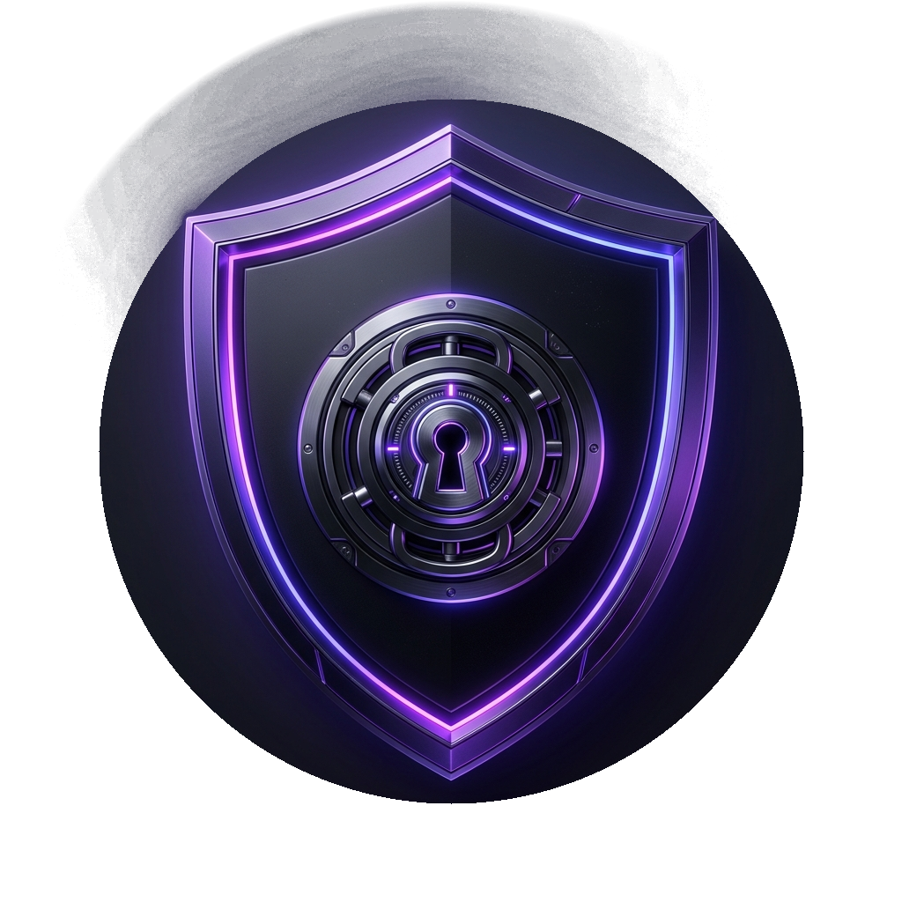

<p align="center">
  
</p>

<h1 align="center">SecureVault</h1>

<p align="center">
  <strong>Zero-knowledge encrypted single-container file vault and private desktop operating system for Windows.</strong>
</p>

<p align="center">
  <a href="https://github.com/QuorLum/SecureVault/actions/workflows/ci.yml"></a>
  <a href="https://github.com/QuorLum/SecureVault/releases"></a>
  <a href="LICENSE"></a>
  <a href="tests/"></a>
  
</p>

<p align="center">
  <a href="#threat-model">Threat Model</a> •
  <a href="#key-features">Features</a> •
  <a href="#download-standalone-executable">Download</a> •
  <a href="#getting-started">Getting Started</a> •
  <a href="#architecture">Architecture</a> •
  <a href="SECURITY.md">Security</a> •
  <a href="CONTRIBUTING.md">Contributing</a> •
  <a href="LICENSE">License</a>
</p>

---

## What is SecureVault?

SecureVault is a personal encrypted digital safe and private operating system for your files on Windows. It stores your documents, media, and archives inside tamper-evident, self-healing `.vault` containers (up to 200GB per file with automatic multi-part chaining) protected by Argon2id key derivation, AES-256-GCM authenticated encryption, and Reed-Solomon error correction. 

Featuring built-in media players, image galleries, PDF readers, and notes editors, SecureVault streams and decrypts content directly in RAM, ensuring sensitive plaintext never touches your physical disk.

---

## Threat Model

> [!IMPORTANT]
> A cryptographic tool is only as strong as the assumptions underlying its design. Please review SecureVault's threat model carefully:

### What SecureVault Protects Against
- **Physical Device Theft & File Interception**: Protects against someone gaining physical access to your laptop, storage drive, or raw vault file (e.g., laptop theft, borrowed machine, lost external drive, or compromised cloud sync/backup account). All file metadata, directories, names, and chunk payloads are encrypted with AES-256-GCM.
- **Casual & Forensics Hex Inspection**: A curious person or automated scanner inspecting the raw `.vault` file in a hex editor cannot read file names, directory hierarchies, timestamps, file sizes, or preview thumbnails.
- **Silent Bit Rot & Transfer Corruption**: Reed-Solomon forward error correction ($RS(255, 223)$) continuously detects and automatically repairs up to 16 corrupted bytes per 223-byte data block, preventing silent data decay across long-term archiving and cloud sync.

### What SecureVault Does NOT Protect Against
- **Active Endpoint Malware**: Someone with an active kernel-level keylogger, screen recorder, or rootkit running on your workstation. (SecureVault employs Windows `SetWindowDisplayAffinity` screen-capture protection, but this cannot defend against compromised OS kernels).
- **Forensic Memory Dumps of Live, Unlocked Sessions**: While decrypted keys and plaintext buffers are pinned in non-swappable RAM (`VirtualLock`) and zeroed upon vault locking, an attacker capturing a raw live physical RAM dump while the vault is unlocked may extract transient plaintext.
- **Losing Both Your Password AND Your Recovery Key**: **This results in permanent, mathematically irreversible data loss by design.** There is no backdoor, no administrative escrow, and no developer reset key. If both your password and your 24-word recovery phrase are lost, your data is gone forever.

---

## Key Features

- **Authenticated Per-Chunk AEAD**: Files are segmented into 1MB chunks, each protected with an independent 12-byte CSPRNG nonce, HMAC/AuthTag, and CRC32.
- **Dual Encrypted Master Index**: Primary and backup index tables are maintained at opposite ends of the container, serialized with dual Argon2id/AES-GCM encryption.
- **Direct In-Memory Streaming**: Stream video, audio, and large files on-demand using seekable memory pipelines without extracting files to temporary storage.
- **Multi-Vault 200GB Overflow Chaining**: Transparently scales past 200GB file system limits by rolling over into `.vault2`, `.vault3` parts governed by a synchronized Global Master Index.
- **Automated Self-Healing & Background Audit**: Detects bit rot in background scans and autonomously repairs corrupted symbols via Reed-Solomon parity.
- **Disaster Recovery Scanner**: Scans raw binary storage for file headers and footers to reconstruct damaged vaults even if the master index is wiped.
- **Screen Protection**: Prevents screen capture, streaming software (OBS, Discord), and remote access tools from recording decrypted content.

---

## Download Standalone Executable

Pre-built standalone single-file executables are available on the [GitHub Releases page](https://github.com/QuorLum/SecureVault/releases).

1. Download `SecureVault.exe` or `SecureVault-v1.0.0-win-x64.zip` from the latest release.
2. Run `SecureVault.exe` directly — no installer or external .NET runtime installation required.

> [!NOTE]
> **Windows SmartScreen Notice:**
> Because SecureVault is an open-source, community-distributed project without an enterprise code-signing certificate, Windows SmartScreen may show an unrecognized-publisher warning on first run (*"Windows protected your PC"*). Click **More info** → **Run anyway** to launch the application. You can verify the SHA-256 checksum of your download against the official `.sha256` hash published with each release.

---

## Getting Started

### System Requirements
- **Operating System**: Windows 10 (version 1809 or higher, 64-bit) or Windows 11
- **Runtime / SDK**: .NET 8.0 SDK (8.0.300 or later)
- **Workload**: .NET Desktop Development & Windows App SDK (WinUI 3)

### Clean Build Instructions

Clone the repository and build using standard .NET tooling:

```powershell
# 1. Clone the repository
git clone https://github.com/QuorLum/SecureVault.git
cd SecureVault

# 2. Build the solution (x64 Release or Debug)
dotnet build src/SecureVault.sln -c Release -p:Platform=x64

# 3. Run the complete cryptographic & integrity test suite
dotnet test tests/SecureVault.Core.Tests/SecureVault.Core.Tests.csproj
```

All 123 tests across core crypto, file operations, multi-part chains, and concurrency will execute and validate container integrity.

### Packaging Standalone Single-File Executable

To package the entire application (WinUI 3, LibVLC, SkiaSharp, PDFium, and .NET 8 runtime) into a single standalone `SecureVault.exe` with companion SHA-256 checksums and zip archive:

```powershell
.\scripts\publish-single-file.ps1
```

The output executable and release bundle are placed in `./publish/SecureVault.exe`.

---

## Architecture & Technology Stack

```
SecureVault/
├── src/
│   ├── SecureVault.Core/          # Pure cryptographic engine & container format
│   │   ├── Crypto/                # AES-GCM, Argon2id, SecureBuffer, Keystream
│   │   ├── Format/                # Header, Footer, ChunkWriter, ChunkReader, Index
│   │   ├── Integrity/             # Reed-Solomon, CRC32, BackgroundRepair, Recovery
│   │   ├── MultiVault/            # 200GB VaultChainManager, Split archives
│   │   └── Operations/            # Add, Replace, Delete, Compaction, Deduplication
│   └── SecureVault.App/           # WinUI 3 modern desktop presentation layer
│       ├── Views/                 # Media players, gallery, timeline, dialogs
│       └── ViewModels/            # MVVM bindings and background thread workers
└── tests/
    ├── SecureVault.Core.Tests/    # 123 xUnit unit, integration, and concurrency tests
    └── vectors/                   # Deterministic cryptographic test vectors (JSON)
```

### Third-Party Dependencies & Licensing
- **LibVLCSharp / LibVLC**: Used for hardware-accelerated in-memory media playback. LibVLC is licensed under **LGPL v2.1/v3** and is **dynamically linked** as separate native shared libraries. SecureVault does not modify LibVLC source code, ensuring full compliance with both the LGPL and SecureVault's MIT license.
- **Konscious.Security.Cryptography**: Argon2id password-based key derivation.
- **SkiaSharp & Magick.NET**: Image decoding, thumbnail rendering, and raw format processing.
- **PdfiumCore**: In-memory PDF viewing.

---

## Known Limitations

1. **Multi-Part Vault Compaction**:
   Compaction of vault chains over 200GB (multiple `.vault`, `.vault2` files) is newer and less tested than single-container compaction. Users should take a verified backup before compacting a multi-part vault chain.
2. **Deep Copy vs. Copy-on-Write**:
   `FileManagementOperations.CopyAsync` executes a physical deep copy (re-encrypting data with fresh nonces and distinct salt) rather than shallow CoW reference counting. While this guarantees absolute file independence and prevents data loss when an original file is replaced or deleted, copying large files increases container size until deduplicated.
3. **Hardware-Level SSD Wear-Leveling**:
   While `SecureTempFile` performs multi-pass random data and zero wiping before deletion, modern SSD/NVMe flash controllers employ wear-leveling and out-of-place block allocation. True silicon-level erasure cannot be guaranteed by any user-mode software; SecureVault mitigates this by executing all viewing, streaming, and editing purely in RAM.
4. **Platform Availability**:
   The desktop user interface is built on WinUI 3 (Windows App SDK) and is currently available exclusively on Windows 10/11 x64.

---

## Contributing

We welcome contributions to SecureVault! Please review [CONTRIBUTING.md](CONTRIBUTING.md) for code conventions, pull requests, and guidelines. For vulnerability disclosures, please refer to our [Security Policy](SECURITY.md).

> [!IMPORTANT]
> **Non-negotiable rule**: Changes to anything in `Crypto/`, `Format/`, or `Integrity/` require a deterministic test-vector diff in the PR, not just passing existing tests.

---

## License

SecureVault is licensed under the [MIT License](LICENSE).
Dynamic third-party dependencies (such as LibVLC) remain under their respective licenses (LGPL v2.1/v3).
